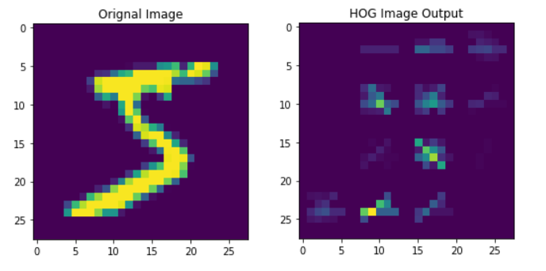
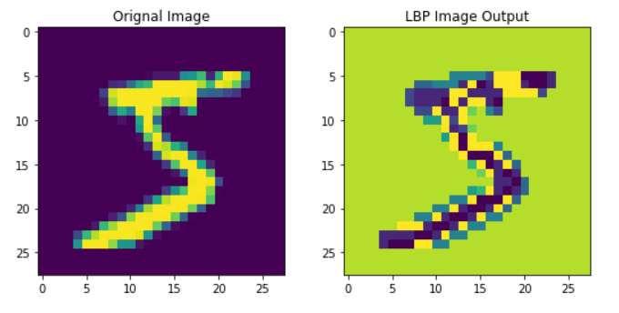
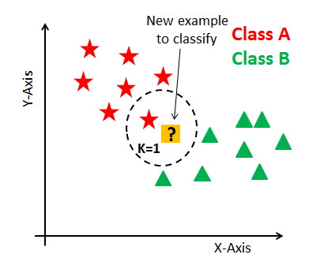
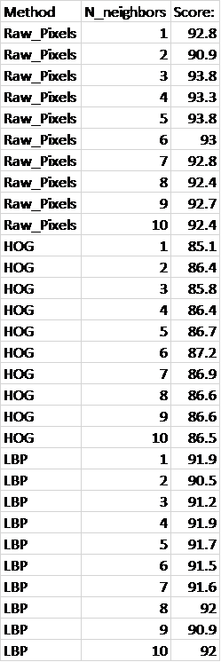
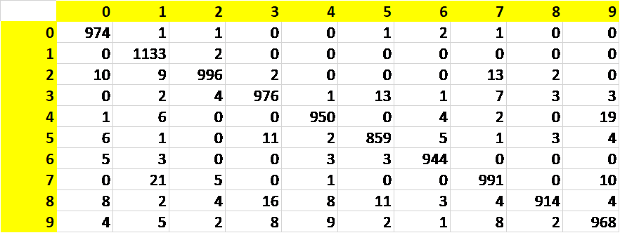
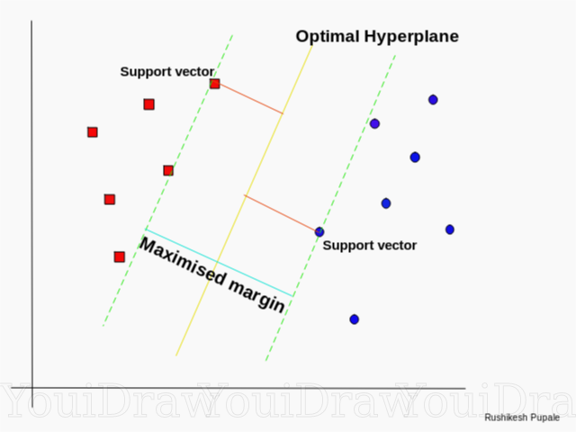
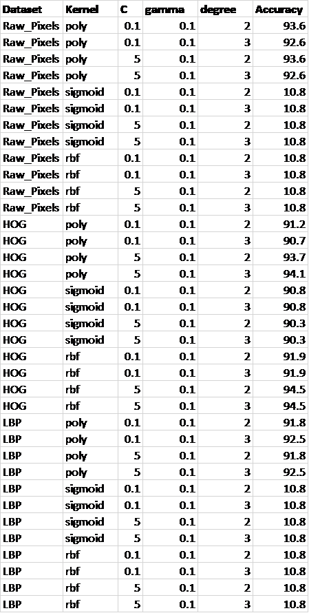
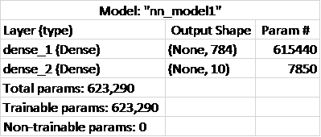
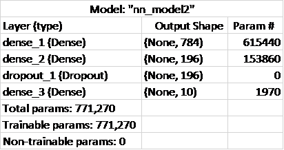
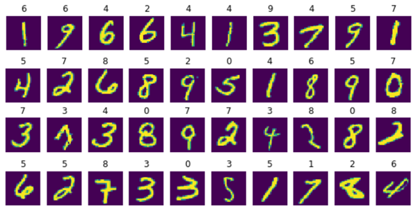

# English-handwritten-Digits-Classification
Human written styles vary person to person even for a single letter or a digit. But there is some similarity in those digits and some unique features that help human to understand it by visualizing different digits. In this we are performing these digits classification, so machine can learn from it and recognized unique features and layout of individual digits. We have applied Histogram-Of-Oriented-Gradients (HOG) and Local Binary Pattern (LBP) on the images to extract features of digits. We used Support vector machine (SVM), K-Nearest Neighbors (KNN) and Neural Network Supervised Algorithms for digits classification. All these algorithms have some pros and cons like time consumption, dataset length and Accuracy. We have received 98% accuracy of classification using Neural Network of 3 layers.

## 1. Dataset:
MNIST Handwritten dataset consists of 60000 training images of digits and 10000 testing images. The dataset consists of 28*28 gray scale images. Visualizing first 40 images from training dataset and their labels. Its shows some examples of style of each digit written by hand.

## 2. Data Preprocessing:

### a.	Histogram-Of-Oriented-Gradients (HOG):
HOG decomposes an image into small squared cells, computes an histogram of oriented gradients in each cell, normalizes the result using a block-wise pattern, and return a descriptor for each cell. We choose [7,7] size of cell so that we can preserve the shape information. HOG generates 144 features array. The output of one image HOG is shown on the side.

### b. Local Binary Pattern (LBP):
Local Binary pattern is a method in which pixels values are changed based on their neighborhood pixels. We have chosen 3 radius and 8 neighbors of lbp. The algorithm work based on sliding window concepts of parameters radius and neighbors and place the middle pixels value.

## 3.	Models:
We have used 3 different type of supervised classification models KNN, SVM and Neural Network. The 3 models architecture and other parameters details are given below:

### a.	K-Nearest Neighbor (KNN):
Its a supervised learning algorithm that classify the data by computing distance between points in dataset. Then Closest points are assigned to one class. It uses number of nearest neighbors to classify the dataset. k-Nearest Neighbors Classifier has been used because of its simplicity, fastness and efficiency. The problem with Neural Network based models DNN or CNN required a lot of data.

#### Testing on different Parameters:
We tried to find the best parameters by testing the knn on different number of n_neighbors, and different dataset like 'Raw pixels','HOG','LBP'. We are only training it on small dataset of random 5000 images and testing it on 1000 images.

By observing the table, the maximum accuracy we have received with using Raw Pixels, and using 3 n_neighbors.

By using knn we have received these results on test data.

    •	Accuracy: 97.05%
    •	Precision: 0.97
    •	Recall: 0.99
    •	F1-score: 0.98

#### KNN Confusion Metrics:

### b.	Support Vector Machines (SVM):

Support Vector Machine classify the dataset based on different hyperplane, its finds the best separating plane that separate different classes points. Its suitable for small to medium size dataset. Its take too much training time on large dataset like MNIST. 

#### Testing on different Parameters:
We are trying to find the best parameters by testing the svm on different kernels, C, gamma, degree and different dataset like 'Raw pixels','HOG','LBP'. We are only training it on small dataset of random 5000 images and testing it on 1000 images.

By observing the upper results, the maximum accuracy we have received with using HOG features, rbf kernel, C=5 and gamma=0.1.

By using svm we have received these results on test data.

    •	Accuracy: 97.18%
    •	Precision: 0.99
    •	Recall: 0.99
    •	F1-score: 0.99

#### SVM Confusion Metrics:

### c.	Neural Network
Neural Network is interconnected layers of neurons, it produces non-linearity on the dataset. It takes inputs then processed by a neuron by applying weights on the input using an activation function to produce an output. We have chosen half the size of neuron in hidden layers from previous layers to make some symmetry. The input layers have number of neurons of image size of 784, and output layers have number of neurons equal to number of classes. We have use sigmoid activation function in Dense layers and softmax function in last Dense layers. Softmax help us to generate probabilites of each class at the end, in it we try to maximize the probabilities. We have used categorical_crossentropy loss function because we have 10 number of classes at the end, in which all entries are 0 except the correspondene class is 1.

We have created 3 Neural network models those Parameters are shown below:

#### Testing on different Parameters:
We are trying to find the best parameters by testing the nn on different models’ architecture and different dataset like 'Raw pixels','HOG','LBP'. 
By observing the Table results, the maximum accuracy we have received with using Model3 and raw images pixels Dataset.

By using NN we have received these results on test data.

    •	Accuracy: 92.36%
    •	Precision: 0.92
    •	Recall: 0.92
    •	F1-score: 0.92

#### Neural Network Confusion Metrics:
 

## 4.	Experimental Results
### a.	Accuracy score comparison of different Algorithms is shown below: 

Classifier/Feature|	HOG| 	LBP| 	Raw Input
--- | --- | --- | --- 
KNN|	87.2|	92.0|	97.05
SVM|	97.18|	92.5|	93.60
ANN|	90.83|	89.98|	92.36

### b.	 Wrong Classified Examples:
Here are few examples of images that are classified Wrongly by Neural Network classifier. Here we can see that some digit has some level of similarity between predicted and actual labels. 

## 5.	Conclusion:
Neural Network Number of parameters are large that help it to capture more dynamic features of handwritten digits but its take time to converge and it required large dataset. We achieved good accuracy on SVM but it takes more prediction time. Hence SVM is quite good in terms of accuracy but not good in terms of memory load, computations and time consumption at the testing time and its benefit is that it required less time for training and required less amount of dataset. 

# 2nd Experiment:

MNIST Dataset

Model Type|	VGG|	RESNET
--- | ---|---
Model Architecture|	VGG16|	Resnet50
Total params|	14847434|	24108554
Training Accuracy|	1.0|	1.0
Training Loss|	4.6742e-05|	3.3328e-05
Validation Accuracy|	0.9948|	0.9940
Validation Loss|	0.0487|	0.0368
Training Time|	1056 sec|	2100 sec
Training Epochs|	21|	34
Test Accuracy|	0.9943000078201294|	0.9934999942779541

    
